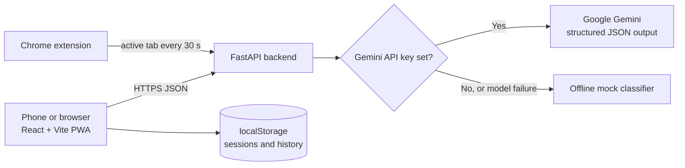

<div align="center">

# 🧭 GoalGuard AI

**Stay focused on what matters, not just what you're doing.**

An intent-aware productivity assistant that judges your activity against the *meaning* of your goal, not an app blocklist.


[**Live app**](YOUR-VERCEL-LINK) · [**API health**](YOUR-RENDER-LINK/health)

</div>

---

## Overview

Most focus tools block apps or websites. That fails in practice, because the same activity can help one goal and hurt another.

GoalGuard AI takes a different approach. You describe your goal in plain language, such as *"Finish my DBMS assignment, 90 min"*. While you work, you log what you are doing. A language model then decides whether that activity matches the **meaning** of your goal, and gives you a kind, non-judgmental nudge when you drift.

| Activity | Goal | Verdict |
|---|---|---|
| YouTube: Top 10 IPL moments | Learn Python for my exam | 🔴 Drifted |
| YouTube: Top 10 IPL moments | Write a blog post on IPL cricket | 🟢 On track |
| Stack Overflow: pandas error | Learn Python for my exam | 🟡 Adjacent |

## Features

- **Natural-language goals.** Durations such as "90 min" or "1.5 hours" are parsed from the text.
- **Editable understanding.** The AI shows the on-track, adjacent and drift examples it inferred, and you can edit them before you start.
- **Three verdicts with reasons.** `on_track`, `adjacent` or `drifted`, each with a confidence score and a short explanation.
- **Gentle nudges.** On drift, a banner appears and the phone vibrates where supported. You can respond with *Back on track* or *I meant to do this*.
- **Gradual drift detection.** Recent activities are sent with each request, so a related video that leads into unrelated content is caught.
- **Live session screen.** A countdown that survives a page refresh, a compass-style status indicator, quick-tap suggestions, periodic check-ins and a running timeline.
- **Session summary.** Focus score, time split, drift timeline strip, context switch tax and an AI insight.
- **History.** Past sessions are stored in the browser.
- **Demo session.** One button runs a scripted 7-step Python exam session using a simulated clock.
- **Mock mode.** With no API key, an offline keyword-based classifier keeps every feature working.
- **Installable PWA** when served over HTTPS.
- **Optional Chrome extension** that reports the active tab to the backend every 30 seconds.

## How scoring works

- **Focus score (0 to 100)** is a time-weighted average: on track counts 1.0, adjacent 0.5, drifted 0. Each log entry lasts until the next one, and the last lasts until the session ends.
- **Context switch** is any move between `on_track` and a non-`on_track` status, in either direction. Moves between adjacent and drifted do not count.
- **Context switch tax** is `switch_count × 10 to 25 minutes`, shown as a low-high range. It is an estimate based on research into how long it takes to regain deep focus after an interruption. It is not a measurement. The constants are in the backend config.

## Architecture



The backend is stateless and has no database. The API key stays on the server and is never sent to the frontend.

```
GoalGuard-AI/
├── backend/
│   ├── main.py               FastAPI routes and CORS
│   ├── models.py             Pydantic request/response schemas
│   ├── config.py             settings and context switch tax constants
│   ├── llm.py                Gemini provider, retry once, then fallback
│   ├── prompts.py            system prompts
│   ├── mock_classifier.py    offline heuristic classifier
│   ├── requirements.txt
│   ├── Procfile
│   └── tests/
│       ├── test_metrics.py       unit tests for scoring
│       ├── run_eval.py           classifier accuracy report
│       ├── classifier_cases.json
│       └── holdout_cases.json    held-out set, not used for tuning
├── frontend/
│   ├── src/                  App.jsx, api.js, index.css, main.jsx
│   ├── public/               icons
│   ├── vite.config.js
│   └── vercel.json
├── extension/                Manifest V3 Chrome extension (optional)
├── start-app.bat             one-step local start on Windows
└── README.md
```

## API

| Method | Path | Description |
|---|---|---|
| `GET` | `/health` | Returns `{ "ok": true, "mock": bool }` |
| `POST` | `/intent` | Turns a goal into on-track, adjacent and drift examples |
| `POST` | `/classify` | Judges one activity and returns `status`, `confidence`, `reason`, `nudge` and `fallback` |
| `POST` | `/summary` | Returns focus score, time split, switch count, tax range and insight |

If the model returns invalid output, the backend retries once. It then falls back to the mock classifier and sets `"fallback": true`.

## Getting started

**Requirements:** Python 3.10 or newer, Node.js 18 or newer, Git.

### 1. Clone

```bash
git clone https://github.com/VishnuVardhan4145/GoalGuard-AI.git
cd GoalGuard-AI
```

### 2. Backend

```powershell
cd backend
python -m venv .venv
.venv\Scripts\Activate.ps1
pip install -r requirements.txt
copy .env.example .env
uvicorn main:app --host 0.0.0.0 --port 8000 --reload
```

Open http://localhost:8000/health. You should see `{"ok":true,...}`.

If PowerShell blocks the activation script, run `Set-ExecutionPolicy -Scope Process Bypass` first.

### 3. Frontend

Open a second terminal:

```powershell
cd frontend
npm install
npm run dev
```

Open http://localhost:5173. In development, the app calls the backend through the `/api` proxy configured in `vite.config.js`.

### 4. Gemini API key (optional)

1. Create a key at https://aistudio.google.com.
2. Edit `backend/.env`:

```env
GEMINI_API_KEY=your_key_here
GEMINI_MODEL=gemini-flash-latest
```

3. Restart the backend. `/health` should now return `"mock": false`.

Leave the key empty, or set `MOCK_LLM=true`, to run in Mock mode. Never commit `.env`. It is listed in `.gitignore`.

## Testing and evaluation

```powershell
cd backend
pytest
python tests/run_eval.py --mock
python tests/run_eval.py
```

| Command | What it does |
|---|---|
| `pytest` | Unit tests for switch counting, focus score math and the tax range |
| `run_eval.py --mock` | Accuracy of the offline classifier on both case sets |
| `run_eval.py` | Accuracy of the real model (requires an API key) |

The evaluation prints overall accuracy and every mismatch. Two sets are used: `classifier_cases.json` for tuning and `holdout_cases.json` for checking. A large gap between the two scores means the classifier was tuned too closely to the first set.

## Deployment

### Backend on Render

| Setting | Value |
|---|---|
| Root directory | `backend` |
| Build command | `pip install -r requirements.txt` |
| Start command | `uvicorn main:app --host 0.0.0.0 --port $PORT` |
| Environment | `GEMINI_API_KEY` (optional), `GEMINI_MODEL=gemini-flash-latest` |

If the build fails on the Python version, add `PYTHON_VERSION=3.12.3`.

### Frontend on Vercel

| Setting | Value |
|---|---|
| Root directory | `frontend` |
| Framework preset | Vite |
| Environment | `VITE_API_BASE` = your Render URL, with no trailing slash |

The backend allows CORS from localhost and any `https://*.vercel.app` origin. Vite reads `VITE_API_BASE` at build time, so redeploy the frontend after you change it.

> **Note:** the free Render tier sleeps when idle. The first request after a break can take 30 to 60 seconds.

## Using it on a phone

- **Deployed link (recommended).** Open the Vercel URL. Because it is HTTPS, you can use *Add to Home Screen* to install it.
- **Same Wi-Fi.** Run `ipconfig` on your PC and open `http://<your-ip>:5173` on the phone. Allow ports 5173 and 8000 when Windows Firewall asks. This is plain HTTP, so PWA install is not available.
- **Temporary HTTPS tunnel.** With the frontend running, use `cloudflared tunnel --url http://localhost:5173`. The link works only while your PC and the terminals are running.

## Chrome extension (optional)

1. Open `chrome://extensions` and turn on **Developer mode**.
2. Click **Load unpacked** and select the `extension/` folder.
3. Start a session in the app. The extension sends the active tab's title and URL to the backend every 30 seconds and shows the drift status in its popup.

## Demo script

1. **Set the goal.** Enter *Learn Python for my exam* and start a session. Show the examples the AI generated.
2. **Show the nudge.** Log *YouTube: Python loops tutorial* (on track), then *YouTube: Top 10 IPL moments*. The compass swings away, the nudge appears and the phone vibrates.
3. **Same activity, different goal.** End the session, start *Write a blog post on IPL cricket*, and log the same IPL activity. It is now on track.

Short on time? Use **Load demo session** to run a scripted 7-step session and go straight to the summary.

## Known limitations

- **Self-reported activity.** A web app cannot see what you do in other apps, so it relies on your logs and check-in prompts. Time is counted from those logs.
- **No native app tracking yet.** Automatic tracking on Android is planned using Usage Access and Accessibility APIs.
- **Mock mode is less subtle.** The offline classifier uses keyword overlap and small word lists, so it is weaker on ambiguous cases than the LLM.
- **Local history only.** Sessions are stored per browser and are not synced between devices.
- **Cold starts.** The free backend tier sleeps when idle.

## Roadmap

- Native Android companion using Usage Access and Accessibility APIs
- Account sync for history across devices
- Per-goal learning from the corrections users make (*I meant to do this*)
- Weekly focus reports

## Contributing

Issues and pull requests are welcome. Please run `pytest` and `python tests/run_eval.py --mock` before you open a PR.

## License

Released under the MIT License. Add a `LICENSE` file to the repository to make this official.

---

<div align="center">
Built by <a href="https://github.com/VishnuVardhan4145">Vishnu Vardhan</a>
</div>
